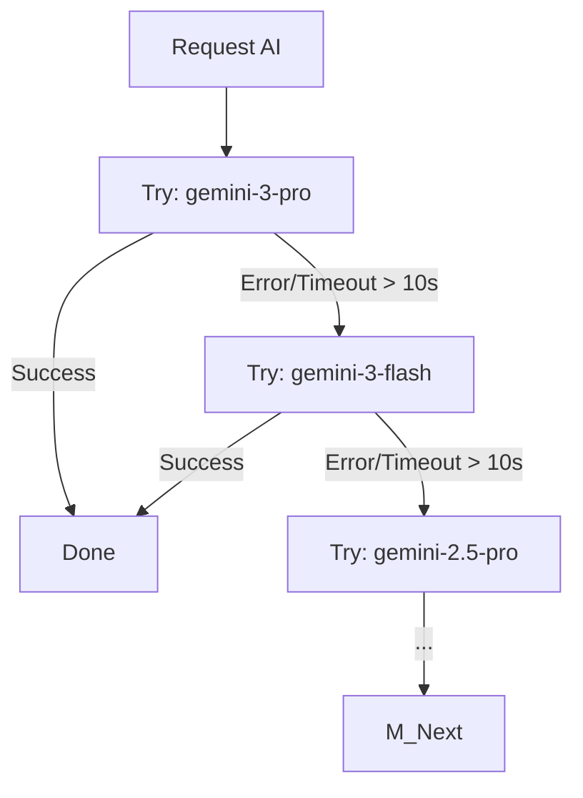

# 💡 BRIEF: AI Waterfall Strategy for SlideGenius

**Ngày tạo:** 2026-01-20
**Module:** Core AI Service

---

## 1. MỤC TIÊU
Nâng cấp `src/core/ai_service.py` từ đơn model sang **Multi-Model Manager** với cơ chế Waterfall Strategy để:
1.  **Tăng độ ổn định:** Fallback sang model khác khi model chính lỗi/timeout.
2.  **Tối ưu chất lượng/tốc độ:** Ưu tiên model mạnh (Pro) trước, fallback sang Flash.
3.  **Mở rộng khả năng:** Tích hợp Image Generation (Imagen) và Video (Veo).

## 2. DANH SÁCH MODEL (Confirmed)

Các model được chia thành các nhóm ưu tiên dựa trên cấu hình "waterfall_strategy":

### Nhóm 1: Top Tier (Ưu tiên cao nhất)
1.  `gemini-3-pro-preview` (Timeout: 10s)
2.  `gemini-3-flash-preview` (Timeout: 10s)

### Nhóm 2: Stable Tier (Fallback 1)
3.  `gemini-2.5-pro` (Timeout: 10s)
4.  `gemini-2.5-flash` (Timeout: 12s)

### Nhóm 3: Specialized / Experimental
5.  `gemini-robotics-er-1.5-preview` (Timeout: 28s) - *Cần xác định use-case*
6.  `gemini-2.5-computer-use-preview` (Timeout: 10s) - *Cần xác định use-case*

### Nhóm 4: Open Models (Gemma)
7.  `gemma-3-27b-it` (Timeout: 17s)
8.  `gemma-3-12b-it` (Timeout: 18s)
... (các bản nhỏ hơn)

### Nhóm 5: Media Generation
-   **Image:** `imagen-4.0-ultra-generate-001` (Timeout: 10s)
-   **Video:** `veo-3.1-generate-preview` (Timeout: 10s)
-   **Audio:** `gemini-2.5-flash-native-audio-latest`

## 3. CƠ CHẾ HOẠT ĐỘNG ĐỀ XUẤT

Chúng ta sẽ xây dựng class `ModelCascade` hoạt động như sau:

**Logic Fallback (Waterfall):**

## 4. CÂU HỎI THẢO LUẬN & XÁC NHẬN

1.  **Cơ chế Fallback:** Anh đồng ý với luồng ưu tiên từ trên xuống dưới (theo list anh gửi) không? Hay muốn group lại (ví dụ thử hết đám Pro rồi mới sang Flash)?
2.  **Use-case đặc biệt:**
    *   `gemini-robotics`: Chúng ta có dùng để phân tích biểu đồ kỹ thuật không?
    *   `computer-use`: Có dùng để tự động tìm kiếm thông tin trên web không?
3.  **Media:** Khi tạo slide, anh muốn tự động generate ảnh minh họa (Imagen) luôn không?

## 5. BƯỚC TIẾP THEO
→ Chạy `/plan` để thiết kế chi tiết class `ModelCascade` và UI cấu hình.
